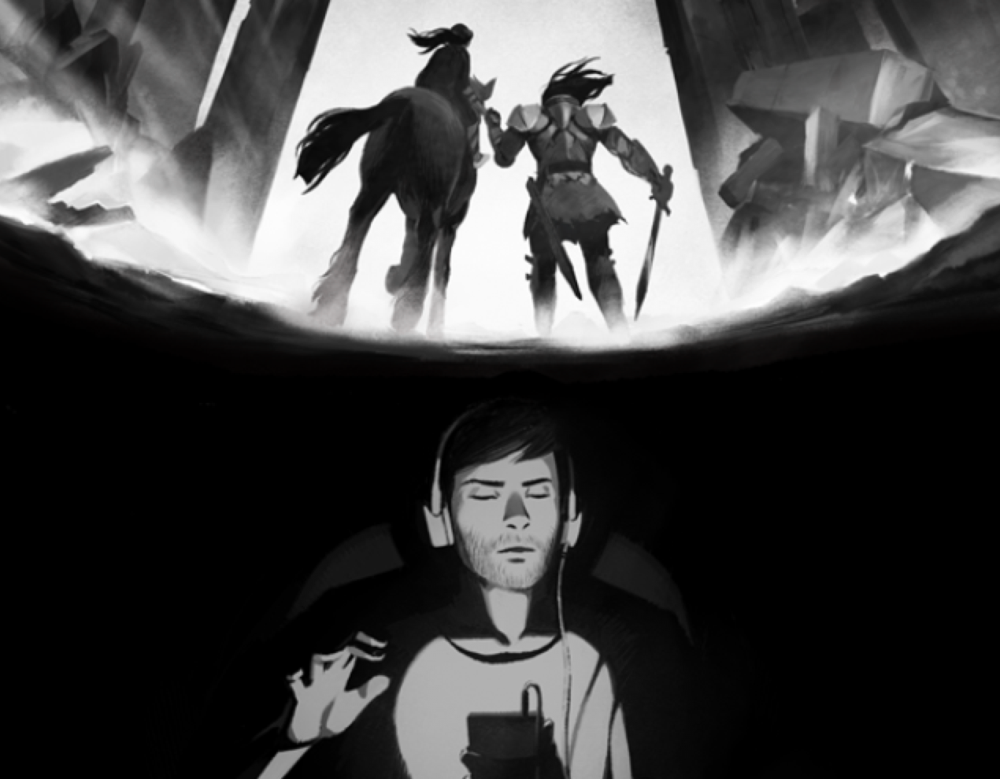
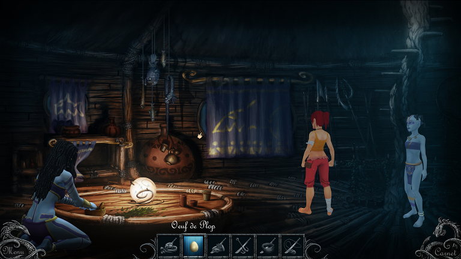

_Bazia Vincent - Castanié Thibaut - M2 IMAGINA_

# Cahier des charges Urban Wheelchair

L’objectif de notre projet est de développer un jeu sérieux de
sensibilisation à propos des difficultés que rencontrent les personnes
en fauteuil roulant dans un milieu urbain non aménagé.

Ce projet sera réalisé avec l’unité d’enseignement Sons et Musique.

## Outils

Pour réaliser notre jeu, nous utiliserons le moteur **Unity 3D**. Afin
de réaliser les sons et la musique, nous utiliserons **LMMS**, ainsi que
**FMOD** et son plug-in Unity pour les intégrer dans le moteur. Enfin,
pour travailler en collaboration, nous utiliserons le système de
versions **Git**, ainsi que des outils de communication vocale à
distance.

## Gameplay

### Synopsis

Combinaison entre deux cœurs de jeu :

-   Course : Atteindre un but le plus rapidement possible.

-   Construction : Modifier les éléments qui gênent le joueur avec un
    équipement adapté.

Le joueur contrôle un personnage en fauteuil roulant dans le monde
inadapté et doit essayer de l’améliorer en modifiant certains obstacles.

### Contrôles

Le joueur utilise les touches fléchées et la souris pour se déplacer
dans l’environnement à la première personne. Le joueur peut avancer,
reculer et pivoter son fauteuil à droite et à gauche. Il utilise la
souris en mode plan et clique sur les éléments à modifier.

Il y a deux vues différentes pour nos deux phases de jeu:

-   Vue 3D mobile à la première personne pour le contrôle de la personne
    en fauteuil roulant.

-   Vue 3D statique de dessus pour modifier les éléments.

### Mécanismes

#### Boucle O-C-R

-   *Objectif* : Terminer le parcours dans un temps imparti

-   *Challenge* : Le parcours n’est pas adapté pour une personne en
    fauteuil roulant.

-   *Récompense* : Une fois un niveau réussi, on a accès au suivant.

-   *Moyens* : Le joueur peut modifier certains éléments du parcours
    afin d’améliorer son temps. (remplacement d’escaliers,
    ascenseur, ...)

### Règles du jeu

Le joueur est propulsé aux commandes d’un fauteuil roulant. Il doit
alors se déplacer dans un environnement urbanisé inadapté pour ses
déplacements. Son but est d’aller d’un point A à un point B dans un
temps donné. Sur son parcours il va devoir faire face à de nombreux
obstacles. Certains d’entre eux vont le ralentir et l’agacer, tandis que
d’autres seront infranchissables, devront être contournés et vont donc
faire perdre beaucoup de temps. Une fois la première tentative
effectuée, le joueur peut accéder au mode plan du parcours et acheter
des équipements pour franchir les obstacles. Il doit cependant
surveiller le budget qui lui est alloué et prendre les mesures
nécessaires.

### Assistance

Au premier lancement des différentes phases de jeu, on présente les
objectifs et les moyens d’y parvenir. Les éléments qui peuvent être
modifiés sont en surbrillances pendant la phase de construction.

### *Feedback*

Le fauteuil roulant produit des sons différents en fonction de son
mouvement. Le personnage exprime son mécontentement face aux obstacles.
Lorsqu’un moyen adapté est installé, il exprime son contentement. Un son
dans le style “récompense” est joué lorsque le parcours est fait dans
les temps, un son d’échec sinon.

### Menu

Le jeu comporte un menu d’accueil basique pour lancer le jeu et
effectuer d’éventuels réglages. En mode déplacement, un chrono montre le
temps passé dans le niveau. En mode plan les éléments modifiables sont
mis en avant et un clic sur l’un d’eux ouvre un menu permettant de
choisir l’équipement à installer. Un menu permettant de recommencer ou
de quitter la partie est disponible (en appuyant sur \[Echap\]).

### Level Design

Les niveaux du jeu se situent dans un milieu urbain composé d’obstacles
modifiables. Obstacles possibles :

-   Escalier sans rampe d’accès

-   Sol (instable, glissant, impraticable, mauvais état, saletés)

-   Des axes de passages encombrés (travaux, obstacles ...)

-   Trottoir (trop étroit, trop haut)

-   Pentes trop brutes

_Informations à propos des normes :_
[fauteuil-roulant.comprendrechoisir.com/comprendre/accessibilite-fauteuil-roulant](http://fauteuil-roulant.comprendrechoisir.com/comprendre/accessibilite-fauteuil-roulant)

## Histoire

Julie a passé la majeure partie de sa vie immobilisée sur un fauteuil
roulant. Récemment, elle décide de s’impliquer dans la vie de sa commune
dont les équipements ne sont pas du tout adaptés aux personnes dans son
cas. Ravi de pouvoir améliorer le quotidien de ses habitants, le maire
décide de lui accorder subvention afin qu’elle puisse se charger de
choisir quels emplacements ou accès sont à améliorer afin de permettre
leur fréquentation par des personnes en fauteuil.

## Analyse de l’existant

Il n’existe actuellement pas de jeu sérieux visant à sensibiliser au
handicap moteur. En revanche, la sensibilisation à d’autres types de
handicaps (visuels, auditifs, vocaux) existe.

### Les secrets d’Ombyliss

Ce jeu aurait pu être le premier jeu du marché à introduire les
difficultés des personnes utilisant un fauteuil roulant à se déplacer
dans un environnement inadapté. Seulement le jeu n’est jamais sorti car
sa campagne de financement participatif n’a pas abouti. Son analyse sera
donc basée sur la présentation faite sur sa page Ulule.

Il s’agit d’un jeu de type *point-and-click*, dans un environnement 3D
où le joueur doit contrôler l’héroïne, Fairhom, pour l’aider à améliorer
l’accessibilité dans la cité d’Ombyliss. Le jeu reprend plusieurs types
de handicaps, mais le handicap moteur est mis en avant, de par la taille
de l’héroïne qui est bien trop petite par rapport aux installations de
la ville.

Le but de ce jeu sérieux est de sensibiliser les jeunes de 10 à 14 ans à
une perception différente de la personne handicapée, afin qu’ils
puissent en parler en classe ou dans des groupes de discussion, et
aborder le sujet du handicap avec un œil neuf. En effet, le terme
“handicap” porte encore aujourd’hui une connotation négative, c’est pour
cela que les développeurs du jeu ont décidé d’en parler, sans y faire
référence. Ainsi, l’aventure se déroule dans un univers fantastique, où
il existes plusieurs espèces qui possèdent des caractéristiques et des
capacités diversifiées.

### A Blind Legend

A Blind Legend est un jeu pour mobiles entièrement basé sur le son. A
l’aide d’un procédé reproduisant la perception du son dans un
environnement en 3D, le joueur progresse en se fiant seulement à ses
oreilles, via quelques gestes sur l’écran de son smartphone.

Le joueur est dans la peau d’un chevalier aveugle, à l’époque du
Moyen-âge. Il est aidé dans sa quête par la voix de sa fille, qui guide
le joueur sur la direction à suivre tout au long de l’aventure. Il faut
ainsi un temps d’adaptation pour ne plus se fier simplement à sa vue,
mais faire confiance à son ouïe. Le jeu consiste en des phases
d’explorations, des phases de “QTE auditifs” et des phases de combat.
Pendant les phases d’explorations, le joueur est plongé dans un
environnement sonore riche et doit suivre la voix de la fille. Pour
cela, un *tap* simple permet de l’entendre nous appeler. On peut alors
se déplacer dans la directions souhaitée en faisant glisser son doigt
sur l’écran à partir de son centre. Une fois la destination de sa fille
atteinte, elle se déplace jusqu’à une nouvelle destination. En se
déplaçant, le joueur entend le bruit de ses propres pas, de ceux de sa
fille, mais aussi de multiples autres sources sonores comme le vent dans
les feuillages, le bruit d’un chariot, le caquètement de poules...
Pendant les phases de QTE, le joueur fait face à des évènements tels une
chute de pierres ou une poursuite à cheval qui testent les réflexes.
Enfin les phases de combats consistent à tendre l’oreille pour
déterminer la position de l’adversaire afin de bloquer ses coups et de
contre-attaquer.

La technologie du jeu permet d’accentuer l’effet stéréo, et
l’utilisation d’un casque ou d’écouteurs est donc nécessaire. Il est
aussi conseillé de fermer les yeux et de s’isoler pour une meilleure
expérience. Après avoir passé un certain temps dans le jeu, on est
surpris de ne plus faire confiance qu’aux sons et bruits qui nous
entourent. Même si cela n’est pas explicitement dit dans le jeu, cela
permet de nous sensibiliser aux personnes possédant un handicap visuel.
On constate facilement qu’il est très difficile de se déplacer et de se
repérer sans une aide extérieure. De plus l’imagination joue un rôle
très important, on se met rapidement à imaginer le paysage qui nous
entoure, seulement au bruit du vent dans les feuillages, au bruit de ses
pas sur les chemins de terre ou pavés; les apparences des personnages de
l’aventure sont aussi propres à notre imagination, en fonction du timbre
de leur voix, de la résonance de leur pas...

Ce jeu identifie donc le handicap en mettant directement le joueur dans
la peau d’un personnage aveugle. Cela permet d’avoir un aperçu de ce que
peut être la vie d’un handicapé visuel, tout en gardant le côté ludique
et scénaristique d’un jeu d’aventure.

### Le silence d’Aquari

Le silence d’Aquari est un jeu de type *point-and-click* où le joueur
est propulsé aux commandes d’un personnage qui s’éveille au sein d’une
cité peuplée d’habitants malentendants, qui utilisent la langue des
signes pour communiquer entre eux.

Le jeu est ouvert à des enfants à partir de 8 ans, afin de les
sensibiliser au handicap auditif. En effet, la particularité du gameplay
réside dans le fait que ce soit l’héroïne qui est en situation de
handicap par rapport aux autres personnages. C’est la seule qui est
“entendante” dans une cité composée d’habitants malentendants. Ainsi, en
inversant la position entre la personne handicapée et non-handicapée, on
pousse le joueur à changer sa perception par rapport à cette thématique,
vu qu’il ne connaît pas la langue des signes.

Une fois de plus, ce jeu sensibilise le joueur par une mise en
situation. En effet, il comprend la difficulté ressentie lorsqu’il faut
s’adapter à un moyen de communication qui n’est pas le sien.
