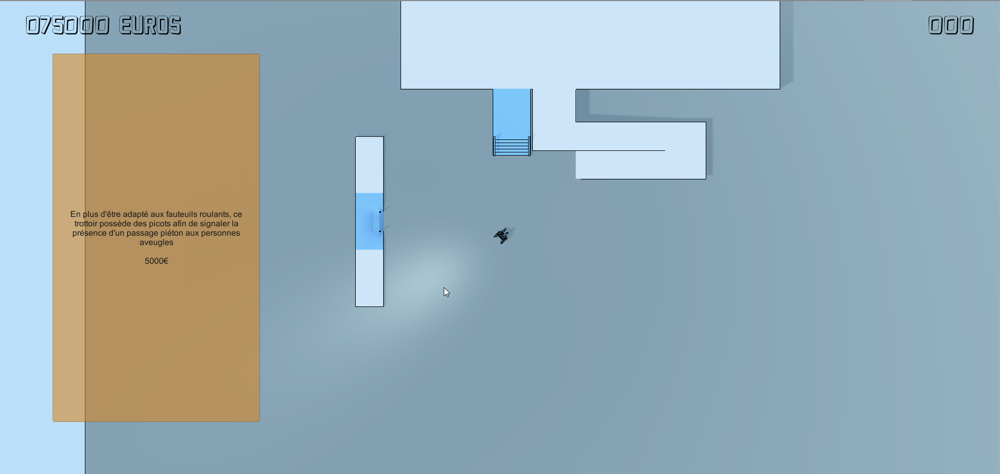
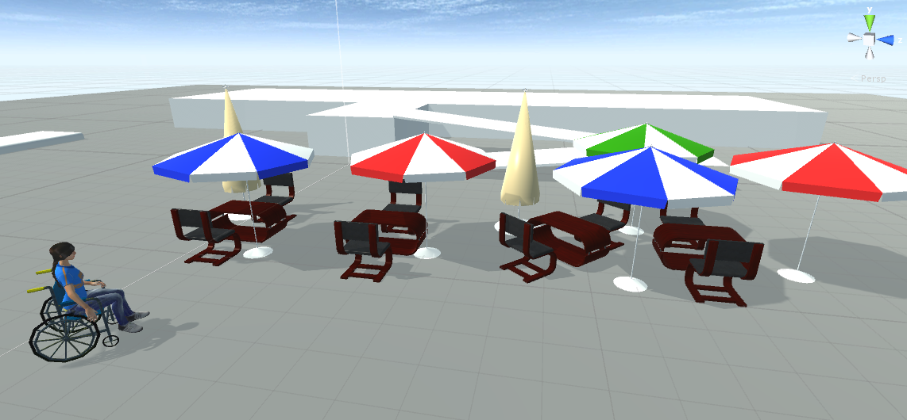
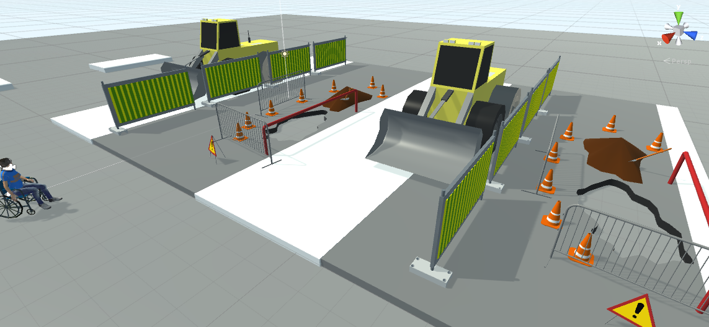
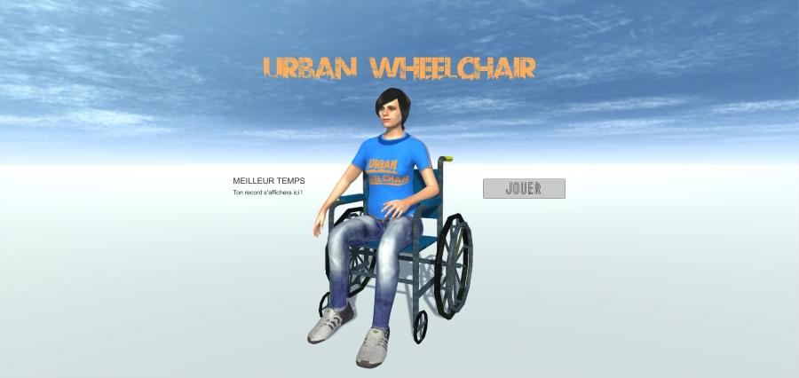
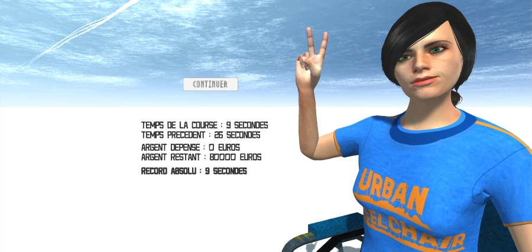
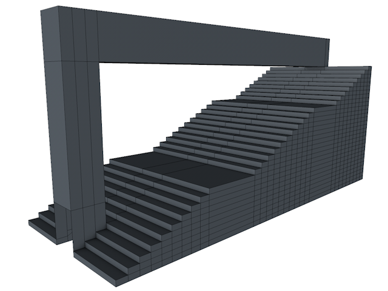
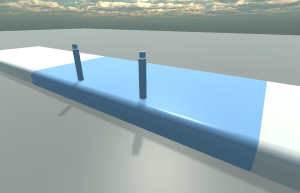
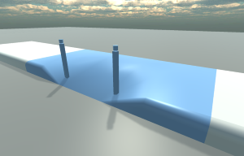

# Urban-Wheelchair

Projet M2 IMAGINA - Jeux Sérieux / Son & Musique

- **[Cahier des charges](./Cahier des charges/cahierDesCharges.md)** 
- **[Rapport Jeu sérieux](./compte-rendu_UrbanWheelchair_Castanié-Bazia.pdf)** _(pdf)_
- **[Manuel d'utilisation Jeu sérieux](./manuel-utilisateur_Bazia-Castanié.pdf)** _(pdf)_
- **[Bande annonce du jeu](https://youtu.be/p38Hv0X_nsw)** sur YouTube
- **[Présentation orale Jeu sérieux](./présentation_urban-wheelchair_Bazia-Castanié.pdf)** _(pdf)_

----

- **[Rapport Son & Musique](./rapport-SonMusique-Bazia-Castanié_UrbanWheelchair.pdf)** _(pdf)_
- **[Présentation orale Son & Musique](./urban-wheelchair_presentation_musique_Bazia_Castanié.pdf)** _(pdf)_

----
----

# Blog de développement

## 14-15-16 décembre

## 12 décembre 2015

----

## 10 décembre 2015

## 01 décembre 2015

## 25 novembre 2015

## 21 novembre 2015

- création d'un trottoir avec 3 états possibles :
	+ non adapté
	+ adapté aux fauteuils roulants
	+ adapté aux fauteuils roulants & aux aveugles

## 20 novembre 2015

- gestion des caméras _Plan_ et _Première personne_
- changement d'équipement sur clic en mode _Plan_
- Ajout d'effets sur la _caméra Plan_

## 12 novembre 2015

