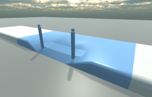
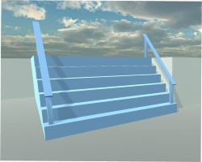
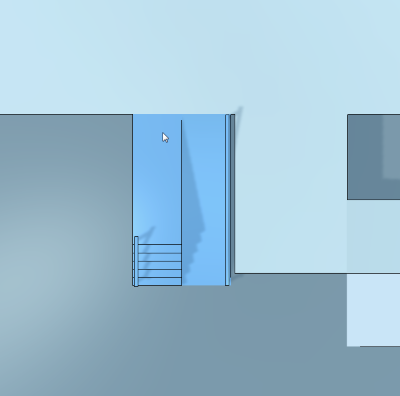
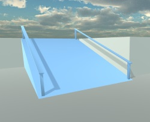
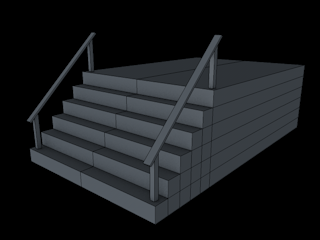
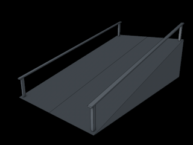
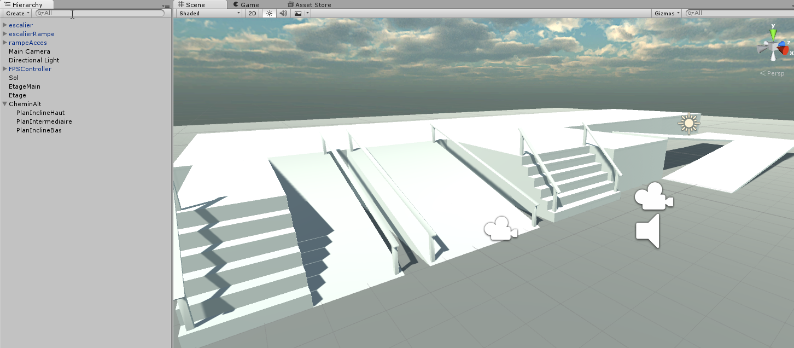

# Urban-Wheelchair

Projet M2 IMAGINA - Jeux Sérieux / Son et Musique

**[Cahier des charges](./Cahier des charges/cahierDesCharges.md)**

## 21 novembre 2015

- création d'un trottoir avec 3 états possibles :
	+ non adapté
	+ adapté aux fauteuils roulants
	+ adapté aux fauteuils roulants & aux aveugles

## 20 novembre 2015

- gestion des caméras _Plan_ et _Première personne_
- changement d'équipement sur clic en mode _Plan_
- Ajout d'effets sur la _caméra Plan_

## 12 novembre 2015

